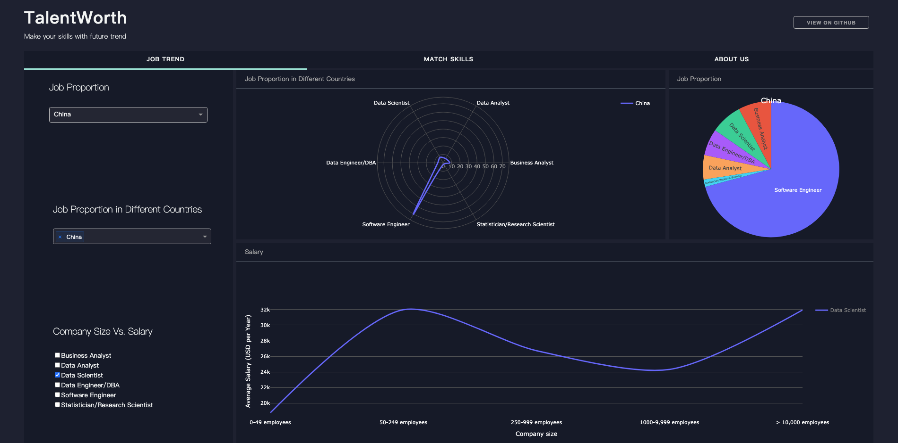

# TalentWorth

  

## Introduction

**TalentWorth** is a dashboard web app with the functionalities:

- Analysis of job market data
- Quick and customizable job market data visualization



## Built with

- [Dash](https://dash.plot.ly/) : Main server and interactive components 
- [Plotly Python](https://plot.ly/python/) : interactive plots 
- [pandas](https://pandas.pydata.org/): data analysis and manipulation 
- [numpy](https://numpy.org/) 

## Requirements

Clone from repo:

```bash
git clone https://github.com/EckoTan0804/talent-worth.git
```

Create a separate virtural environment:

```bash
cd talent-worth
python3 -m virtualenv venv
source venv/bin/activate
```

Install all of the required packages to this environment:

```bash
pip install -r requirements.txt
```

## Datasets

Datasets we've used are

- [Data Jobs Listings - Glassdoor](https://www.kaggle.com/andresionek/data-jobs-listings-glassdoor) : +160k Data Related Jobs Listings Extracted From [Glassdoor](https://www.glassdoor.com/index.htm)
- [2019 Kaggle Machine Learning & Data Science Survey](https://www.kaggle.com/c/kaggle-survey-2019/data): The most comprehensive dataset available on the state of ML and data science
- [Country names 2 digit codes](https://gist.github.com/EckoTan0804/101eafa84b457355399261596698fefa) : List of countries names and their 2 digit codes

Since size of dataset is large (e.g. Glassdoor dataset is more than 800MB), we've conducted data cleaning and preprocessing before applying datasets to our web app. Check out the [Jupyter Notebook](talent_worth.ipynb) for more details.

## Run

Run this app locally:

```bash
python app.py
```

Then open http://127.0.0.1:8052/ in browser, you'll see a live-updating app.

## Deployment

- This app is deployed on [Heroku](https://www.heroku.com/). Click [here](https://talent-worth.herokuapp.com/) to view.
- Every push to `main` branch will deploy a new version of this app automatically.
